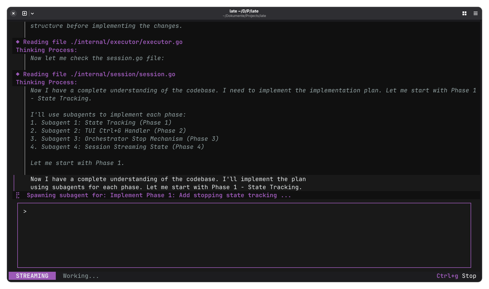

# Late: High-Leverage AI Agent Orchestration

> Every other coding agent feeds your session into one context window until it hallucinates. Late delegates like a real engineering team: one architect plans, ephemeral subagents execute exact edits, nothing bleeds between tasks. Single static binary, zero config, zero dependencies — no runtimes, no `node_modules`, no venvs. Zero to first prompt in seconds.

[](https://github.com/mlhher/late-cli/stargazers)

[](https://github.com/mlhher/late-cli/releases) [](https://github.com/mlhher/homebrew-late) [](https://goreportcard.com/report/github.com/mlhher/late) [](https://deepwiki.com/mlhher/late-cli)

**Late** (Lightweight AI Terminal Environment) is a deterministic coding agent orchestrator designed to give a solo developer the execution throughput of an entire engineering team.

Standard AI coding assistants dump massive contexts into a single window, leading to token bloat, amnesia, hallucinations and degraded ability. **Late solves this by mirroring real engineering teams:** a Lead Architect orchestrator maps the codebase and spawns ephemeral, isolated subagents to execute perfect, exact-match code edits.


*Late acting as Lead Architect: Orchestrating a multi-phase plan and autonomously spawning atomic subagents.*

> **Built with Late:** As of today, the vast majority of Late is being built *inside* Late.

### Key Features

- **Orchestrator + subagents** — Lead Architect plans, ephemeral subagents execute with fresh contexts that never pollute the planner
- **Exact-match diffs** — strict `search`/`replace` blocks with autonomous self-healing on mismatch
- **Hybrid model routing** — use a smart model for planning and a fast/cheap model for execution
- **Human-in-the-loop** — auto-approves reads, hard-stops for mutations, with session/project/global trust scopes and TTL decay
- **Session save/resume** — checkpoint and resume long-running sessions across restarts
- **MCP integration** — connect to Model Context Protocol servers for extended tooling
- **Agent Skills** — composable instruction packs from [agentskills.io](https://agentskills.io/)
- **Git worktrees** — parallel isolated agent instances across branches
- **Pure Go, zero dependencies** — single static binary, no runtimes, no `node_modules`
- **Local-first & model-agnostic** — orchestrates on 5GB VRAM; works with any OpenAI-compatible endpoint

---

## 🔥 Why Late?

### 1. The Industry Standard is Broken (And How Late is Different)

Tools like Claude Code, OpenCode, OpenClaw and virtually every other harness right now are naive, brute-force wrappers. They feed your entire session into a single, ever-growing context window. If the agent gets confused, their only solution is to expect you to throw a bigger model at it, either buying a new GPU or paying more for API calls.

Late takes the opposite approach. A lean orchestrator delegates to ephemeral sub-agents, each spawned with a fresh, strictly scoped context. When a sub-agent finishes its task, its history is destroyed. It never pollutes the planner's context. This mirrors how real engineering teams operate: isolated tasks, no noise.

By ruthlessly managing the KV cache, Late guarantees blazing-fast processing speeds and zero context degradation. It refuses to inject unnecessary history that only serves to confuse the model and burn your API budget. 

It runs autonomously on just 5GB VRAM with local models, or drop in any OpenAI-compatible cloud endpoint.

### 2. Delegation Over Context Bloat

**Zero Prompt Bloat:** Standard terminal agents eat 10,000+ tokens just for their system prompt, exhausting your VRAM or burning your money through API usage before you even start working. Late's core system prompt is ruthlessly optimized to ~1,000 tokens, leaving your context window open for what actually matters: your code. Throwing larger models at a problem doesn't solve context degradation. As context pollutes, models suffer massive performance drops.
* **The Orchestrator:** Holds the master plan, reads the codebase, and delegates.
* **Atomic Subagents:** Receive fresh, empty context windows containing *only* the exact instructions for a single task.

### 3. Zero Silently Broken Code (Exact-Match Diffs)

Standard agents use fragile diff formats that frequently hallucinate and corrupt files. Late forces subagents to use strict exact-match `search`/`replace` string blocks. If the model fails the match, the edit fails loudly, and the Agent initiates an **autonomous self-healing loop** until it gets it right.

### 4. Zero-Surprise Execution (Human-in-the-Loop)

You shouldn't have to blindly trust a generative model with your terminal, but you also shouldn't have to babysit it. Late knows the difference between gathering context and changing state — **it stays out of your way for the safe stuff, and hard-stops for your approval on the rest.**

* **Speed Heuristic:** Simple read-only commands (`ls`, `cat`, `grep`) are auto-approved to maintain agent velocity. Compound, mutating, or unrecognized commands require your explicit `[y/N]` confirmation before execution. This is a convenience heuristic, not a security sandbox — you are always the final authority.
* **Project-Scoped:** The agent operates within your project directory (`cd` is blocked), keeping it focused on the codebase. To maintain momentum, standard file edits inside the current working directory are auto-approved.
* **Turn Limits:** Hard configurable caps cleanly cut off infinite hallucinations and prevent runaway token burning.

### 5. Pure Go & No Dependencies

A statically compiled engine. No `node_modules`, no virtual environments, no bloat. Drop the binary in your path and go.

### 6. Local-First & Model Agnostic

Requires any OpenAI-compatible endpoint. Late's ephemeral subagent architecture is designed for consumer hardware: subagent contexts are destroyed on completion and never pollute the planner's window, keeping VRAM and context usage flat regardless of task complexity. Late orchestrates its own codebase development on **5GB VRAM** using a local `Qwen3.6-35B-A3B` (~30 tokens/sec through `llama.cpp`, 65k context, remaining layers offloaded to system RAM). Two simultaneous agent instances run comfortably at ~15 t/s.
Natively supports both thinking and non-thinking models (including extra support for `Gemma 4`), or can be pointed at heavy-compute cloud endpoints for complex architectural tasks.

---

## 🚀 Quick Start (Zero Dependencies)

```bash
# Homebrew (macOS / Linux)
brew tap mlhher/late && brew install late

# Or download the binary directly
# https://github.com/mlhher/late-cli/releases
```

<details>
<summary>Manual install (no package manager)</summary>

Grab the latest single-binary release for your OS (Linux/macOS/Windows) from the [Releases](https://github.com/mlhher/late-cli/releases) page.

```bash
chmod +x late-linux-amd64  # (Adjust for your downloaded filename)
mv late-linux-amd64 ~/.local/bin/late # Ensure ~/.local/bin is in your system's $PATH
```

</details>

**Point to Your Model**
Set any OpenAI-compatible API endpoint (local or cloud).

```bash
export OPENAI_BASE_URL="http://localhost:8080"
```

> **Note for Windows users:** Use your shell's native export command (e.g. `$env:OPENAI_BASE_URL="http://localhost:8080"` in PowerShell).

**Run**

```bash
late
```

📖 Next Steps: See the **[Quickstart Guide](docs/quickstart.md)** for advanced setup (e.g. API keys, subagent models, persistent configuration), keyboard shortcuts, and more features (including MCP integration).

> 🌟 **Are you finding Late useful?** If Late is helping you build things, consider leaving a star on [GitHub](https://github.com/mlhher/late-cli) so other developers can find it.

---

## 🔨 Build from Source

If you prefer to compile Late yourself (requires Go):

```bash
git clone https://github.com/mlhher/late.git
cd late
make build
make install
```

---

## 🛠️ Advanced Features

* **Native MCP Integration:** Dynamically map external MCP servers directly into Late via standard I/O.
* **Stateful Resilience:** The Orchestrator maintains continuous, newest-first session history on disk (`~/.local/share/late`), ensuring perfect context retention across runs.
* **Git Worktree Support:** Run independent, parallel Late instances across multiple Git worktrees for isolated feature development without context switching.
* **Agent Skills:** Full support for [Agent Skills](https://agentskills.io/) for reusable sets of instructions and scripts.

For more information, check out the [quickstart guide](docs/quickstart.md).

---

## 📜 License: BSL 1.1

We built this to generate real engineering leverage, not to supply free backend infrastructure for AI startups.

* **Free for Builders:** You may use Late freely to write code for any project, including your own commercial startups. We do not restrict your output.
* **Commercial Restrictions:** You may not monetize Late itself (e.g., wrapping our orchestration engine into a paid AI service), nor deploy Late as internal infrastructure within enterprise environments without a commercial agreement.

*Late safely converts to an open-source GPLv2 license on February 21, 2030.*

## Star History

[](https://www.star-history.com/?repos=mlhher%2Flate-cli&type=date&logscale=&legend=top-left)
